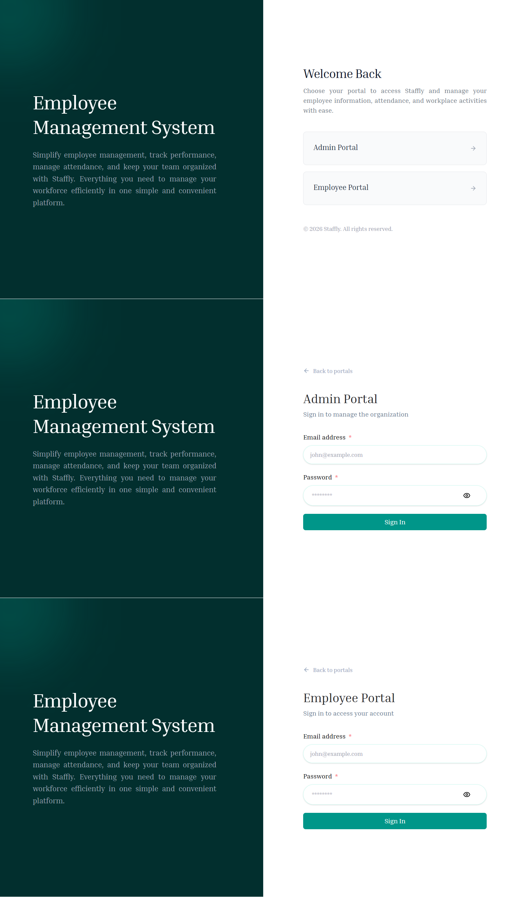
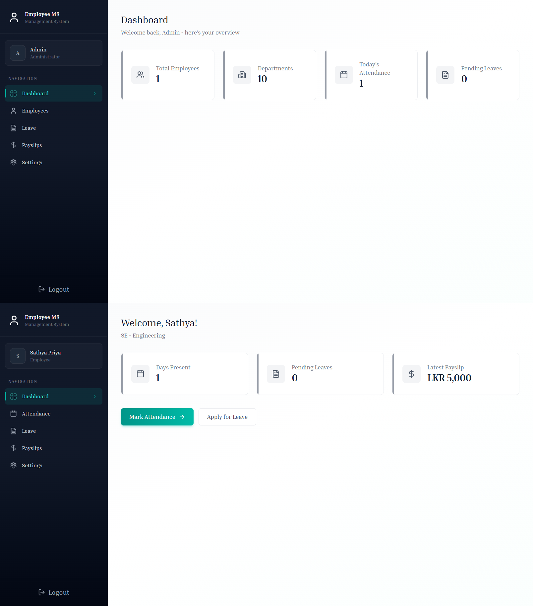
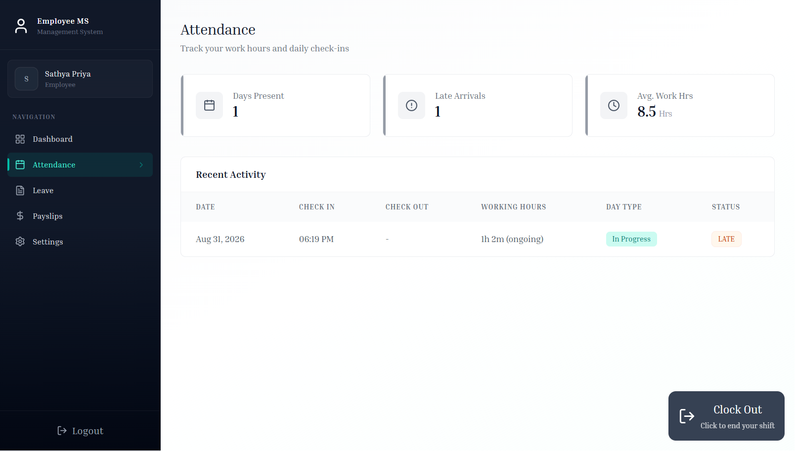
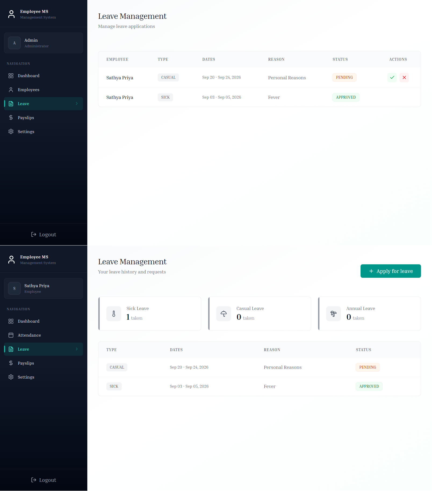
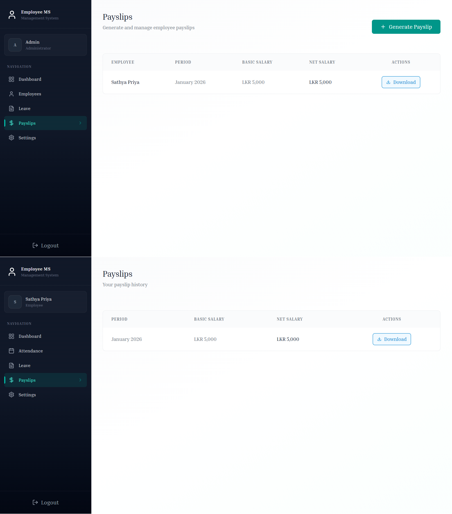
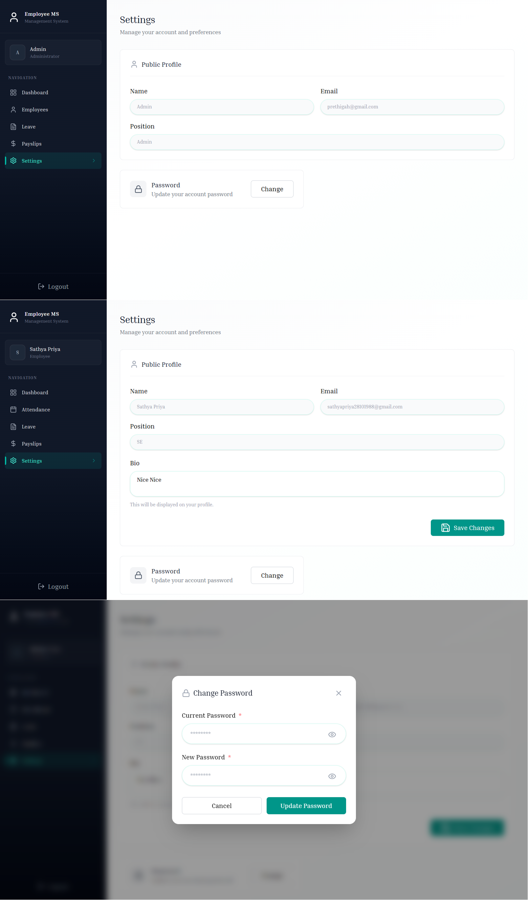

# 💼 Staffly

[](https://react.dev/)

[](https://nodejs.org/)

[](https://www.mongodb.com/)

[](https://expressjs.com/)

[](https://tailwindcss.com/)

---

# 💼 About Staffly

**Staffly** is a full-stack **Employee Management System** built using the **MERN Stack (MongoDB, Express.js, React.js, Node.js).**

It provides a modern platform for managing employees, attendance, leave requests, payslips, profiles, and administrative tasks.

The application allows organizations to:

* Manage employee information
* Manage employee attendance
* Track employee check-in and check-out
* Manage leave applications
* Generate and manage payslips
* View employee profiles
* Manage employee details
* Provide role-based access for Admins and Employees
* Send email notifications
* Automate background tasks and scheduled processes

Staffly includes **secure JWT-based authentication**, **background jobs and scheduling using Inngest**, **email notifications using NodeMailer**, and **deployment support with Vercel**, making it a practical full-stack employee management platform.

This project focuses on real-world employee management use cases, including:

* Role-based access control
* Employee management
* Attendance management
* Leave management
* Payslip generation
* Profile management
* Email notifications
* Background jobs and scheduling
* REST API architecture
* Responsive user interface

A **portfolio-ready full-stack Employee Management System.**

---

# ✨ Features

## 👤 Employee Features

* Employee authentication
* Secure login
* View dashboard
* View personal profile
* Update profile information
* Check in for attendance
* Check out for attendance
* View attendance history
* Apply for leave
* View leave applications
* View leave status
* View payslips
* View payslip details
* Print payslips
* Responsive UI

## 👨‍💼 Admin Features

* Admin authentication
* Admin dashboard
* View employees
* Add new employees
* Update employee details
* Delete employees
* Manage employee status
* View employee attendance
* Manage leave applications
* Approve or reject leave requests
* Generate employee payslips
* Manage payslips
* View employee profiles
* View employee management statistics
* Automated background tasks
* Email notifications

## ⚙️ System Features

* JWT authentication
* Role-based access control
* REST API
* MongoDB database
* Mongoose data modeling
* Background jobs using Inngest
* Scheduled tasks
* Email notifications using NodeMailer
* File upload support using Multer
* Responsive design
* Loading states
* Form validation
* Toast notifications
* Vercel deployment support

---

# 🛠️ Technologies Used

## Frontend

* React 19
* Vite
* Tailwind CSS 4
* React Router DOM
* Axios
* React Hot Toast
* React Spinners
* React Select
* Lucide React Icons
* Date-fns

---

## Backend

* Node.js
* Express.js
* MongoDB
* Mongoose
* REST APIs
* JWT Authentication
* Bcrypt
* Inngest
* NodeMailer
* Multer
* CORS
* Dotenv
* Vercel Deployment

---

# 📸 Screenshots

## 🔐 Login Page



---

## 📊 Dashboard



---

## 🕐 Attendance Page



---

## 📝 Leave Page



---

## 💰 Payslips Page



---

## ⚙️ Settings Page



---

# ⚙️ How to Run the Project

## 1. Clone Repository

```bash
git clone https://github.com/PrethigahShanmugarajah/Staffly.git

cd Staffly
```

---

## 2. Backend Setup (Server)

```bash
cd Server

npm install

npm run server
```

The backend server will run on:

```text
http://localhost:4000
```

---

## 3. Frontend Setup (Client)

Open another terminal:

```bash
cd Client

npm install

npm run dev
```

The frontend will then be available through the Vite development server.

---

# 🔑 Environment Variables

## 📂 Server (.env)

Create a `.env` file inside the **Server** folder:

```env
PORT=

MONGODB_URI=

PROJECT_NAME=

JWT_SECRET=
JWT_EXPIRES_IN=

ADMIN_EMAIL=
ADMIN_PASSWORD=

INNGEST_EVENT_KEY=
INNGEST_SIGNING_KEY=

SMTP_USER=
SMTP_PASS=
SENDER_EMAIL=
```

---

## 📂 Client (.env)

Create a `.env` file inside the **Client** folder:

```env
VITE_CURRENCY=
VITE_BASE_URL=
```

For local development:

```env
VITE_CURRENCY=
VITE_BASE_URL=
```

> **Note:** Never commit your `.env` files or real secret values to GitHub. Add them to `.gitignore`.

---

# 🚀 Deployment

Staffly can be deployed using **Vercel**.

The application consists of:

* **Client** — React + Vite frontend
* **Server** — Node.js + Express backend
* **MongoDB** — Database
* **Inngest** — Background jobs and scheduled tasks
* **SMTP / NodeMailer** — Email notifications

When deploying, configure all required environment variables in the hosting platform instead of committing them to the repository.

---

# 👨‍💻 Author

**Prethigah Shanmugarajah (2020/2021)**
Department of Software Engineering
Faculty of Computing
Sabaragamuwa University of Sri Lanka

---
